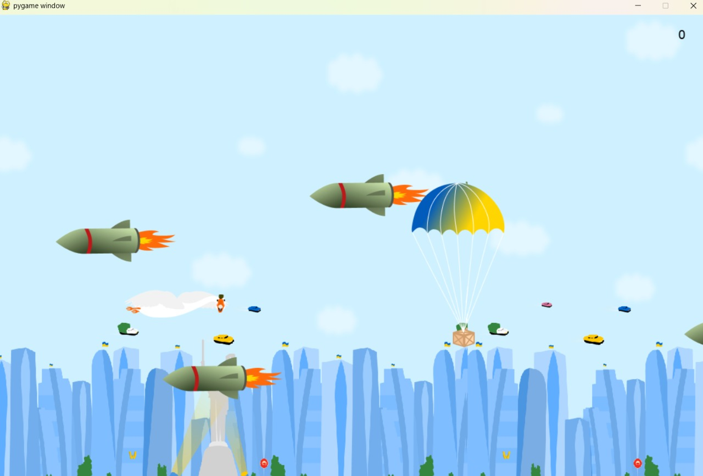
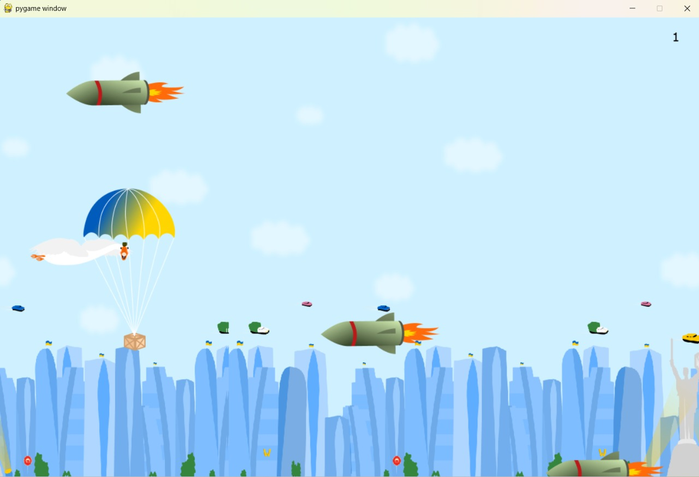

# 🎮 My Game – Ein einfaches 2D-Spiel in Python

## 🧩 Projektbeschreibung

**My Game** ist ein kleines 2D-Spiel, das vollständig in Python entwickelt wurde. Die Spielerfigur kann sich entlang der x- und y-Achse bewegen, Bonusobjekte sammeln und feindlichen Figuren ausweichen. Bei einer Kollision mit einem Gegner ist das Spiel beendet.

Dieses Projekt wurde als Teil meines Einstiegs in die IT entwickelt und zeigt mein Interesse an Programmierung, Spielmechanik und logischem Denken.

## 🧰 Verwendete Technologien

- Python 3
- Standardbibliotheken (z. B. `random`)
- Editor: Visual Studio Code

## 🕹️ Spielmechanik

- Bewegung der Spielfigur über Tastatureingaben
- Sammeln von Bonusobjekten für Punkte
- Vermeidung von Gegnern (Game Over bei Kollision)

## 🚀 Projekt starten

```bash
python main.py
```` ``` ````
# python_game

## 📸 Screenshots




## 🎯 Was ich gelernt habe

- Strukturierung eines kleinen Python-Projekts  
- Arbeit mit Benutzersteuerung und Koordinaten  
- Erste Einblicke in Spielelogik und Interaktionen

## 🔗 Projektdateien

- `main.py`
- `screenshots/gameplay1.png`
- `screenshots/gameplay2.png`
